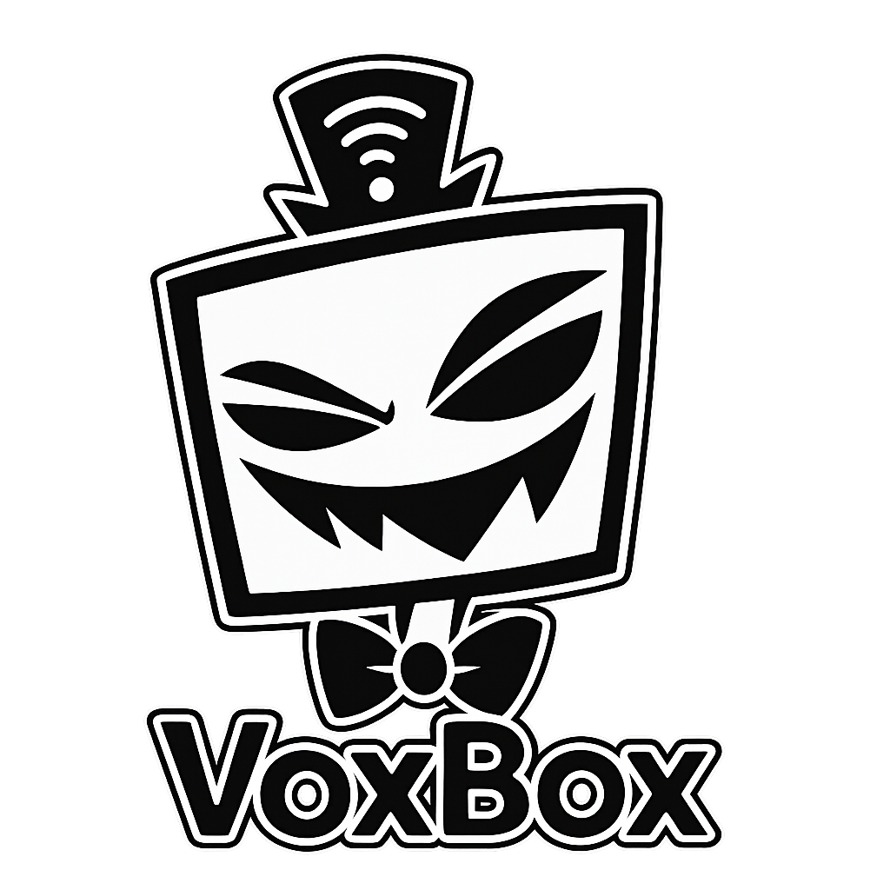

# VoxBox: Interactive AI Character Experience

<p align="center">
  
</p>

## Overview

VoxBox is an immersive AI character experience that brings Vox from the popular series Hazbin Hotel to life. This application allows users to have verbal conversations with an AI-powered version of Vox, complete with voice responses and facial animations.

## Features

- **Voice-Based Interaction**: Speak directly to Vox using your microphone
- **GPT-Powered Responses**: Leverages OpenAI's GPT models to generate contextually appropriate and character-accurate responses
- **High-Quality Voice Synthesis**: Uses ElevenLabs text-to-speech technology to create authentic-sounding voice responses
- **Facial Animation**: Dynamic facial animations synchronized with speech patterns
- **Immersive Experience**: Complete audio-visual experience that simulates a conversation with the character

## Technical Implementation

- **Speech Recognition**: Captures and processes user voice input
- **Natural Language Processing**: Uses OpenAI's GPT models to understand context and generate character-appropriate responses
- **Text-to-Speech**: Converts generated text to speech using ElevenLabs' advanced voice synthesis
- **Animation System**: Synchronizes facial animations with audio output to create realistic talking movements

## Requirements

- Python 3.7+
- OpenAI API key
- ElevenLabs API key
- Required Python packages (see installation instructions)

## Installation

1. Clone this repository
2. Install required dependencies:
   ```
   pip install openai pygame SpeechRecognition pillow requests
   ```
3. Set up your API keys:
   - Create a file named `OpenAISecretKey` with your OpenAI API key
   - Create a file named `ElevenLabsSecretKey` with your ElevenLabs API key

## Usage

Run the application:
```
python src/app.py
```

Speak to Vox when prompted and enjoy the interactive experience!

## Project Structure

- `src/app.py`: Main application file
- `src/utils.py`: Utility functions for audio recording and playback
- `src/idle.png`, `src/inbetween.png`, `src/mouth_open.png`: Facial animation images

## Credits

Created by Julian Bauer

---

*Note: This project is a fan creation and is not affiliated with the creators of Hazbin Hotel.*
